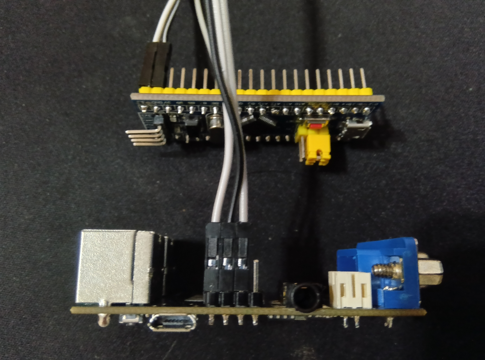

---
# ESP32-FabGL-MSX1Emulator

## Demonstration

*Watch the MSX1 emulator running 'Gradius' with SCC sound simulation on YouTube.*

[Japanese / [English](#english)]

---

## 概要
ESP32とFabGLライブラリを使用したMSX1エミュレータです（開発中）。

## 構成プロジェクト / Included Projects

1. **MSX Emulator (ESP32)**
   - FabGLベースのMSX本体エミュレータ。

2. **Joystick Converter (STM32)**
   - アタリ仕様のジョイスティックをESP32-MSXEmulator仕様に変換するためのユニット。

### クレジットと謝辞
- **グラフィック/オーディオエンジン**: [Fabrizio Di Vittorio氏](https://github.com)による FabGL を使用しています。
- **Z80 CPUコア**: Marat Fayzullin氏によるコードをベースに改変して使用しています。
- **VDPセクション**: David Latham氏によるTMS9918Aエミュレーションコアをベースに、Marat Fayzullin氏が調整を加えた実装を改変して使用しています。

### 動作確認済み環境 / ビルド設定
- **ボード**: ESP32 Dev Module
- **ESP32 ボードマネージャ**: v2.0.5 (推奨)
- **使用ライブラリ**: FabGL v1.0.9
- **Arduino IDE 推奨設定**:
  - **PSRAM**: "Enabled" (必須)
  - **Partition Scheme**: "Default 4MB with SPIFFS" 等

### 免責事項・注意事項
- 本ソフトウェア内の各コアのライセンスは、FabGL、および Marat Fayzullin氏 (fMSX License) の各ポリシーに従います。
- 本プロジェクトは開発中であり、不具合や最適化不足なコードが含まれる場合があります。
- 本ソフトウェアの使用によって生じたいかなる損害についても、開発者は一切の責任を負いません。

■ 1. 本プロジェクトの目的と背景
本プロジェクトは、ESP32とFabGLライブラリを使用し、MSX1エミュレータを実機に近い60FPSで動作させることを目的としています。
ESP32の実行リソースが限られているため、実機の完全な再現（100%の互換性）ではなく快適な動作環境の構築を目指しています。

【開発・ライセンス・ローカライズに関するご注意】
・MSX.ino上のコードの殆どはAIで生成し、製作者はそれを切り貼りして構成しています。製作者自身もコードのすべてを完全に理解しているわけではありません。
そのため、ソースコードの具体的な仕様やロジックに関する詳細な質問にはお答えいたしかねます。
・キーボードの対応は日本語・米英語・ポルトガル語・スペイン語のレイアウトを用意していますが、これらはすべてAIにて生成したものであり日本語以外の環境では動作検証をしていません。
//Please select one of the following options.
#define KEYBORD_MAP (KeyboardLayout::JAPANESE)
//#define KEYBORD_MAP (KeyboardLayout::US_ENGLISH)
//#define KEYBORD_MAP (KeyboardLayout::PORTUGUESE)
//#define KEYBORD_MAP (KeyboardLayout::SPANISH)
ご使用の環境にて不具合が生じた場合、ご自身でローカライズをお願いします。また、修正されたコードの公開を歓迎します。
・ライセンス関連はMSX.ino冒頭の文章を読み、了承したうえで本ソフトウエアをご使用ください。

■ 2. システム構成
再現するMSX1の構成は以下の通りです。
・スロット構成
Slot 0: メインBIOS
Slot 1: ゲームカートリッジ
Slot 2: ディスクBIOS
Slot 3: RAM (64KB)
・非対応事項: スロット拡張、OPLL（FM音源）、カートリッジ二本挿しには対応していません。

■ 3. SDカードの構成とセットアップ
動作には、SDカードのルートディレクトリに以下の配置が必要です。
SAVEフォルダ含む各フォルダはあらかじめSDカード上に作成しておいてください。

/ (SD Root)
├── MSX.ROM         : MSX1本体の純正BIOS (32KB / 必須)
├── DISK.ROM        : ディスクインターフェースROM (16KB / FDD使用時に必須)
├── /ROM            : ゲームROMファイル (.rom) を格納
│   └── /SAVE       : ステートセーブデータ保存用フォルダ
│       ├── slot1.st : スロット1のデータ
│       └── ...
└── /DISK           : ディスクイメージファイル (.dsk) を格納

ROMマッパーは自動判別しません。以下の識別子(半角)をファイル名に加えてください。
Konami…(K)
Ascii8KB…(A8)
Ascii16KB…(A16)
32KB以下…なし

【重要：ROMに関する注意】
・BIOS: 本エミュレータは純正BIOSを前提としています。C-BIOSには対応していません。
・DISK.ROM: FDDを使用する場合、I/Oポートアクセス型のDISK.ROMが必要です。メモリマップドI/O型には対応していません。
FDDを使用しない場合、下記をコメントアウトしてください。
#define USE_FDC

■ 4. 起動シーケンス
起動時のFD・ROM選択状況によって動作モードが自動的に切り替わります。

1. FD選択あり ＋ ROM選択あり → ROM起動 (DISK.ROM有効)
2. FD選択あり ＋ ROM非選択 → FD起動 (ディスクからブート)
3. FD非選択 ＋ ROM選択あり → ROM起動 (DISK.ROMはロードされません)
4. FD非選択 ＋ ROM非選択 → BASIC起動　(DISK.ROM有効)

※コピープロテクトがかかっている市販ソフトは起動できません。

■ 5. 拡張機能操作ガイド（ファンクションキー）
システム設定に関わる操作は、[F12] で一時停止（Pause）した状態で行う必要があります。

【5-1. システム操作】
・[F12] : 一時停止 (Pause) / 再開
・[Shift] + [F12] : ハードウェアリセット (ESP32再起動)

【5-2. ステートセーブ＆ロード】

1. PSRAM（一時保存）: 電源を切ると消去されます
・[Pause中に Shift + F11] ＋ [1～5] : クイックセーブ
・[Pause中に F11] ＋ [1～5] : クイックロード
2. SDカード（永続保存）: 電源を切っても残ります
・[Pause中に Shift + F10] ＋ [1～5] : PSRAMのデータをSDへ書き出し
・[Pause中に F10] ＋ [1～5] : SDのデータをPSRAMへ読み込み
※SDからロードしたデータを反映させるには、[F10]で読み込み後に [F11] ＋ [1～5] を実行してください。

【5-3. ディスクドライブ（FDD）操作】
・[Pause中に F9] : ディスク選択メニューを表示
・[Pause中に Shift + F9] : RAM上のディスクデータをSDへ書き戻し
※ライトプロテクト機能はありません。オリジナルデータは別途保管してください。

【5-4. リアルタイム設定（プレイ中に操作可能）】
・[F8] : SCCモード切り替え（PSGのみ / PSG+SCC）
SCC非対応ゲームでもプリセット波形メモリ音源を使用可能です。
※SCC対応ソフト実行時には使用しないでください。
・[Shift] + [F8] : スプライト横方向制限の解除
同一ライン上の表示制限（4個）を撤廃し、キャラのチラつきを抑えます。
※衝突検出・5枚目検出機能が停止します。不具合が生じる場合はOFFにしてください。

■ 6. ジョイスティック（外部コントローラー）の接続
本プロジェクトでは、ESP32のシリアルポート（UART）を介して外部変換機から送信されるアタリ仕様コントローラーの信号をサポートしています。
【6-1. 接続仕様】
通信規格: RS-232C シリアル通信
ボーレート: 115200 bps
接続ポート：IO39
更新周期: 16.67ms (約59.94Hz)
対応ポート: MSX ジョイスティックポート 1 および ポート 2
【6-2. 外部変換器のデータフォーマット】
シリアル経由で以下の2バイトバイナリデータを受信し、MSXのジョイスティック状態に反映します。
データは「1Pデータ → 2Pデータ」の順で連続送信されることを想定しています。
ビット構造（1バイトあたり）:
Bit機能内容
b7 ID 0 = Port A (1P) / 1 = Port B (2P)
b6 ボタン3 0:ON / 1:OFF (Active Low)
b5 ボタン2 0:ON / 1:OFF
b4 ボタン1 0:ON / 1:OFF
b3 右 (Right) 0:ON / 1:OFF
b2 左 (Left) 0:ON / 1:OFF
b1 下 (Down) 0:ON / 1:OFF
b0 上 (Up) 0:ON / 1:OFF

基板にヘッダを半田付けします。基板の端側のピン(白：3.3V　黒：GND　グレー：RX)に接続します。
---

## English Summary

### Overview
MSX1 Emulator for ESP32 using the FabGL library (Work in Progress).

## 構成プロジェクト / Included Projects

1. **MSX Emulator (ESP32)**
   - MSX main unit emulator based on FabGL.

2. **Joystick Converter (STM32)**
   - A unit for converting Atari-style joysticks for use with the ESP32 MSX Emulator.

### Credits & Acknowledgments
- **Graphics/Audio Engine**: [FabGL](https://github.com) by Fabrizio Di Vittorio.
- **Z80 CPU Core**: Based on code by Marat Fayzullin.
- **VDP Section**: Based on TMS9918A core by David Latham, with adjustments by Marat Fayzullin.

### Build Requirements & Settings
- **Board**: ESP32 Dev Module
- **ESP32 Board Manager**: v2.0.5 (Recommended)
- **Required Library**: FabGL v1.0.9
- **Arduino IDE Settings**:
  - **PSRAM**: "Enabled" (Required)
  - **Partition Scheme**: "Default 4MB with SPIFFS" or similar.

### Important Notes & License
- This project adheres to the licenses of FabGL and Marat Fayzullin (fMSX License).
- This is a work in progress; it may contain bugs or unoptimized code.
- The developer is not responsible for any damage caused by using this software.

■ 1. Project Purpose and Background
This project aims to run an MSX1 emulator at 60 FPS using an ESP32 and the FabGL library. Due to the limited hardware resources of the ESP32, the goal is not a 100% perfect reproduction of the original machine, but rather the creation of a comfortable and playable environment.

[Notes on Development, Licensing, and Localization]

* Most of the code in MSX.ino was generated by AI, and the developer has primarily assembled and integrated these parts. The developer does not fully understand every detail of the code. Therefore, we cannot answer technical questions regarding specific logic or internal specifications of the source code.
* Keyboard layouts are available for Japanese, US English, Portuguese, and Spanish. However, these were all AI-generated and have not been tested in environments other than Japanese.

// Please select one of the following options.
#define KEYBOARD_MAP (KeyboardLayout::JAPANESE)
//#define KEYBOARD_MAP (KeyboardLayout::US_ENGLISH)
//#define KEYBOARD_MAP (KeyboardLayout::PORTUGUESE)
//#define KEYBOARD_MAP (KeyboardLayout::SPANISH)

If you encounter issues in your specific environment, please perform your own localization. We welcome the public release of any corrected code.

* Regarding licensing, please read the text at the beginning of MSX.ino and agree to the terms before using this software.

■ 2. System Configuration
The emulated MSX1 configuration is as follows:

* Slot Configuration:
Slot 0: Main BIOS
Slot 1: Game Cartridge
Slot 2: Disk BIOS
Slot 3: RAM (64KB)
* Unsupported: Slot expansion, OPLL (FM Sound), and dual-cartridge setups are not supported.

■ 3. SD Card Configuration and Setup
The following files and folders must be placed in the root directory of the SD card. Please ensure all folders, including the SAVE folder, are created beforehand.

/ (SD Root)
├── MSX.ROM         : MSX1 Original BIOS (32KB / Required)
├── DISK.ROM        : Disk Interface ROM (16KB / Required for FDD)
├── /ROM            : Folder for Game ROM files (.rom)
│   └── /SAVE       : Folder for State Save data
│       ├── slot1.st : Data for Slot 1
│       └── ...
└── /DISK           : Folder for Disk Image files (.dsk)

ROM mappers are not detected automatically.
Please add one of the following identifiers (half‑width) to the file name:

Konami … (K)
ASCII 8KB … (A8)
ASCII 16KB … (A16)
32KB or smaller … none

[Important: Notes on ROMs]
* BIOS: This emulator requires an original BIOS. C-BIOS is not supported.
* DISK.ROM: To use the FDD, an I/O port access type DISK.ROM is required. Memory-mapped I/O types are not supported.
If you do not intend to use the FDD, please comment out the following line:
#define USE_FDC

■ 4. Boot Sequence
The operation mode is automatically determined based on the availability of Disk and ROM files at startup:

1. Disk Selected + ROM Selected -> Boot ROM (DISK.ROM enabled)
2. Disk Selected + No ROM      -> Boot Disk (Boot from floppy)
3. No Disk     + ROM Selected -> Boot ROM (DISK.ROM is NOT loaded)
4. No Disk     + No ROM      -> Boot BASIC (DISK.ROM enabled)

* Commercial software with copy protection cannot be launched.

■ 5. Extended Functions Guide (Function Keys)
System-related operations must be performed while the emulator is in a Paused state (press [F12]).

[5-1. System Operations]

* [F12]          : Pause / Resume
* [Shift] + [F12]: Hardware Reset (Restart ESP32)

[5-2. State Save & Load]

1. PSRAM (Temporary): Data is lost when power is turned off.

* [Shift + F11] + [1-5] (While Paused): Quick Save
* [F11] + [1-5]         (While Paused): Quick Load

2. SD Card (Permanent): Data persists after power-off.

* [Shift + F10] + [1-5] (While Paused): Export PSRAM data to SD Card
* [F10] + [1-5]         (While Paused): Import data from SD Card to PSRAM

* To apply the data loaded from the SD card, press [F10] to load, then press [F11] + [1–5].

[5-3. Disk Drive (FDD) Operations]

* [F9]         (While Paused): Display Disk Selection Menu
* [Shift + F9] (While Paused): Write back RAM disk data to the SD Card

* There is no write-protect feature. Please keep backups of your original data separately.

[5-4. Real-time Settings (Adjustable during gameplay)]

* [F8]: Toggle SCC Mode (PSG Only / PSG + SCC)
Enables preset wave-table sound even for non-SCC games.
* Do not use this with software that already supports SCC.

* [Shift] + [F8]: Remove Horizontal Sprite Limit
Removes the standard 4-sprite-per-line limit to reduce flickering.
* This disables collision and 5th-sprite detection. Disable this if it causes glitches.

■ 6. Joystick (External Controller) Connection
This project supports Atari-standard controller signals sent from an external converter via the ESP32's serial port (UART).

【6-1. Connection Specifications】
Communication Standard: RS-232C Serial Communication

Baud Rate: 115200 bps

Connection Port: IO39 (RX)

Update Cycle: 16.67ms (Approx. 59.94Hz)

Supported Ports: MSX Joystick Port 1 and Port 2

【6-2. External Converter Data Format】
The emulator receives the following 2-byte binary data via serial and maps it to the MSX joystick status. The data is expected to be transmitted continuously in the order of "1P Data -> 2P Data."

Bit Structure (Per Byte):
Bit | Function | Content
----+----------+-------------------------------
b7  | ID       | 0 = Port A (1P) / 1 = Port B (2P)
b6  | Button 3 | 0:ON / 1:OFF (Active Low)
b5  | Button 2 | 0:ON / 1:OFF
b4  | Button 1 | 0:ON / 1:OFF
b3  | Right    | 0:ON / 1:OFF
b2  | Left     | 0:ON / 1:OFF
b1  | Down     | 0:ON / 1:OFF
b0  | Up       | 0:ON / 1:OFF

Solder the headers to the board. Connect to the pins on the edge of the board (White: 3.3V, Black: GND, Grey: RX).
---